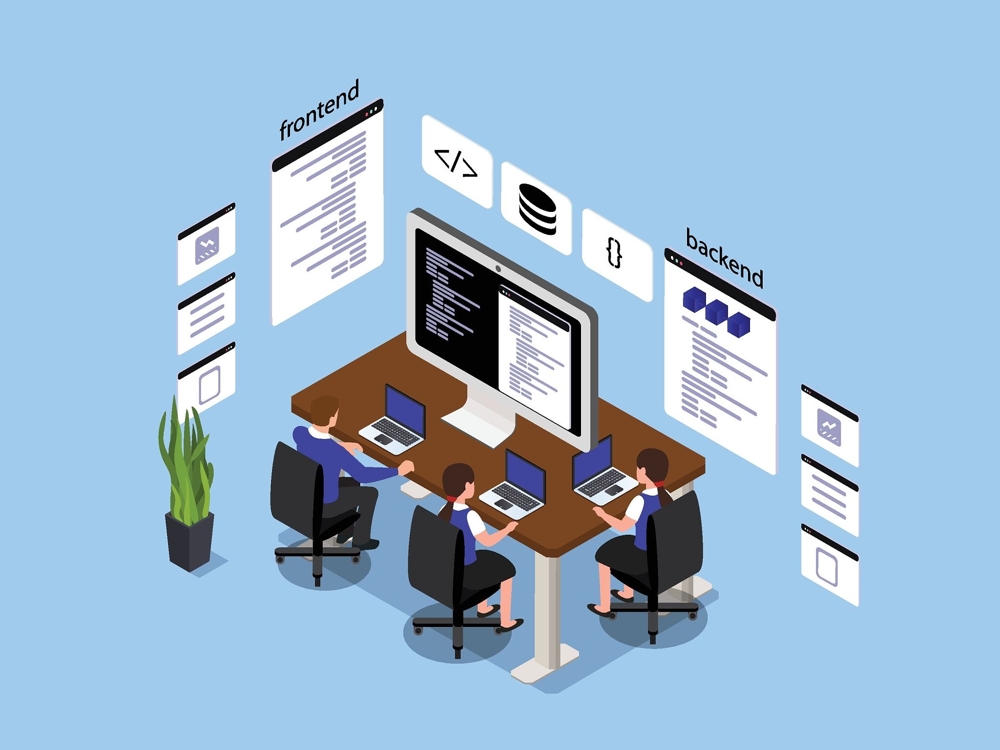
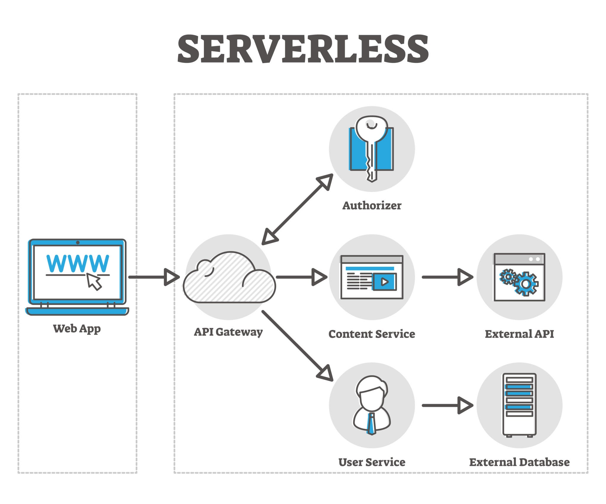

# Web Architecture Fundamentals: How the Internet Works

## 1. How Websites Work
At its core, a website is simply a collection of files (text, images, code) stored on a special computer called a **Server**, which is always connected to the internet. When you type a web address (URL) into your browser, you are asking that server to send those files to your screen.

**Visual Analogy: The Restaurant**
*   **The Browser (You)**: You sit at a table and look at a menu.
*   **The URL (The Order)**: You tell the waiter you want a burger.
*   **The Internet (The Waiter)**: The waiter carries your order to the kitchen.
*   **The Server (The Kitchen)**: The kitchen gathers the ingredients, cooks the burger, and puts it on a plate.
*   **The Render (The Meal)**: The waiter brings the food back, and you can finally consume it.

## 2. Client-Server Architecture
This is the fundamental relationship that powers the internet. It is a continuous loop of Requests and Responses.
*   **The Client**: The hardware and software requesting the data (e.g., your smartphone, your laptop's web browser).
*   **The Server**: A powerful, centralized computer that stores the data, listens for requests, and serves the correct files back.

> **Logic Example: The Library**
> 
> You (the *Client*) go to the front desk and ask for a specific book on history (the *Request*). The librarian (the *Server*) goes into the archives, finds the exact book, and hands it back to you (the *Response*).

## 3. Frontend and Backend Concepts
Web development is divided into two main hemispheres: what the user interacts with (Frontend) and what happens behind the scenes (Backend). 

### Frontend (Client-Side)
Everything you can see, click, and interact with on a screen.
*   **HTML**: The structure (the bones).
*   **CSS**: The styling and colors (the skin and clothes).
*   **JavaScript**: The interactivity (the muscles).

### Backend (Server-Side)
The logic, data storage, and security that make the frontend work.
*   **Server**: The computer hosting the application.
*   **Database**: The organized storage system for data (e.g., user passwords, product inventory).
*   **Application Logic**: The code (written in Python, Node.js, Java, etc.) that processes rules and connects the server to the database.

> **Logic Example: The Theater Production**
> 
> The **Frontend** is the stage, the actors, the painted scenery, and the music—everything the audience sees and hears. The **Backend** is the backstage: the stagehands, the script, the lighting controls, the dressing rooms, and the director making sure everything runs perfectly out of sight.

## 4. Web Application Workflows
A web application is more complex than a static website because it processes dynamic data. Here is the sequential workflow of a standard web app action.

1.  **User Input (Client)**
    The user fills out a form, like logging in with an email and password, and clicks "Submit".
2.  **HTTP Request (Network)**
    The browser packages this data into a secure request and sends it across the internet to the server.
3.  **Routing & Logic (Backend)**
    The server receives the request. The application logic checks what is being asked (e.g., "Does this user exist? Is the password correct?").
4.  **Database Query (Data Layer)**
    The server asks the database to search for the user's email and verify the password hash. The database returns a "Yes" or "No".
5.  **HTTP Response (Network)**
    The server bundles the result (e.g., a success message and user profile data) and sends it back to the browser.
6.  **Rendering (Client)**
    The browser receives the data, updates the screen dynamically, and takes the user to their dashboard.

## 5. Modern Web Architecture
In the early days of the web, applications were built as **Monoliths**—everything (frontend, backend, database) was tangled into one massive block of code. Modern web architecture breaks things into smaller, independent pieces for speed, scalability, and reliability.

### Key Modern Concepts:
*   **Microservices**: Instead of one giant backend, the application is split into tiny independent services (e.g., one service just handles billing, another handles user profiles, another handles emails).
*   **APIs (Application Programming Interfaces)**: The standardized messengers that allow these different microservices (and the frontend) to talk to each other seamlessly.
*   **Cloud Hosting & Serverless**: Instead of owning physical server racks, companies rent flexible server space from providers like AWS or Google Cloud. "Serverless" means the code only runs—and costs money—at the exact millisecond it is triggered.

> **Logic Example: The Swiss Army Knife vs. The Toolbelt**
> 
> A **Monolithic Architecture** is a Swiss Army Knife. It has a knife, scissors, and a screwdriver all built into one handle. If the scissors break, you have to send the whole knife away to get fixed, leaving you without any tools.
> 
> A **Microservices Architecture** is a mechanic's toolbelt. You have separate, distinct tools. If your wrench breaks, you just throw it out and buy a new wrench—the rest of your tools keep working perfectly in the meantime.
